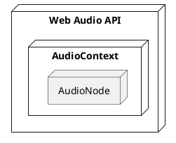

---
# try also 'default' to start simple
theme: seriph
# random image from a curated Unsplash collection by Anthony
# like them? see https://unsplash.com/collections/94734566/slidev
background: https://images.unsplash.com/photo-1611532736579-6b16e2b50449?ixlib=rb-1.2.1&ixid=MnwxMjA3fDB8MHxwaG90by1wYWdlfHx8fGVufDB8fHx8&auto=format&fit=crop&w=3452&q=80
# apply any windi css classes to the current slide
class: 'text-center'
# https://sli.dev/custom/highlighters.html
highlighter: shiki
# show line numbers in code blocks
lineNumbers: false
# some information about the slides, markdown enabled
info: |
  ## Slidev Starter Template
  Presentation slides for developers.

  Learn more at [Sli.dev](https://sli.dev)
# persist drawings in exports and build
drawings:
  persist: false
# use UnoCSS (experimental)
css: unocss
---

# 音频可视化

Audio Visualization

---

# 网络音频应用程序编程接口 Web Audio API

- **Web Audio API** 提供一个音频上下文环境 **AudioContext**，通过模块化路由的方式实现对音频数据的处理操作
- 处理音频数据的操作是基于音频节点 **AudioNode** 实现的，音频节点连接起来构成音频路由图

<div class="container flex justify-center p-4">



</div>

---

# 音频上下文 AudioContext

- **AudioContext** 是 Web Audio API 的应用环境，可以类比于 canvas 中的 context ，提供了创建各种音频节点对象，监听全局事件，暂停读取音频数据的时间进程等操作API

<div class="overflow-auto h-md">

```ts
/** An audio-processing graph built from audio modules linked together, each represented by an AudioNode. */
interface AudioContext extends BaseAudioContext {
    readonly baseLatency: number;
    close(): Promise<void>;
    createMediaElementSource(mediaElement: HTMLMediaElement): MediaElementAudioSourceNode;
    createMediaStreamDestination(): MediaStreamAudioDestinationNode;
    createMediaStreamSource(mediaStream: MediaStream): MediaStreamAudioSourceNode;
    getOutputTimestamp(): AudioTimestamp;
    resume(): Promise<void>;
    suspend(): Promise<void>;
    addEventListener<K extends keyof BaseAudioContextEventMap>(type: K, listener: (this: AudioContext, ev: BaseAudioContextEventMap[K]) => any, options?: boolean | AddEventListenerOptions): void;
    addEventListener(type: string, listener: EventListenerOrEventListenerObject, options?: boolean | AddEventListenerOptions): void;
    removeEventListener<K extends keyof BaseAudioContextEventMap>(type: K, listener: (this: AudioContext, ev: BaseAudioContextEventMap[K]) => any, options?: boolean | EventListenerOptions): void;
    removeEventListener(type: string, listener: EventListenerOrEventListenerObject, options?: boolean | EventListenerOptions): void;
}

```

```ts
interface BaseAudioContext extends EventTarget {
  /** Available only in secure contexts. */
  readonly audioWorklet: AudioWorklet;
  readonly currentTime: number;
  readonly destination: AudioDestinationNode;
  readonly listener: AudioListener;
  onstatechange: ((this: BaseAudioContext, ev: Event) => any) | null;
  readonly sampleRate: number;
  readonly state: AudioContextState;
  createAnalyser(): AnalyserNode;
  createBiquadFilter(): BiquadFilterNode;
  createBuffer(numberOfChannels: number, length: number, sampleRate: number): AudioBuffer;
  createBufferSource(): AudioBufferSourceNode;
  createChannelMerger(numberOfInputs?: number): ChannelMergerNode;
  createChannelSplitter(numberOfOutputs?: number): ChannelSplitterNode;
  createConstantSource(): ConstantSourceNode;
  createConvolver(): ConvolverNode;
  createDelay(maxDelayTime?: number): DelayNode;
  createDynamicsCompressor(): DynamicsCompressorNode;
  createGain(): GainNode;
  createIIRFilter(feedforward: number[], feedback: number[]): IIRFilterNode;
  createOscillator(): OscillatorNode;
  createPanner(): PannerNode;
  createPeriodicWave(real: number[] | Float32Array, imag: number[] | Float32Array, constraints?: PeriodicWaveConstraints): PeriodicWave;
  /** @deprecated */
  createScriptProcessor(bufferSize?: number, numberOfInputChannels?: number, numberOfOutputChannels?: number): ScriptProcessorNode;
  createStereoPanner(): StereoPannerNode;
  createWaveShaper(): WaveShaperNode;
  decodeAudioData(audioData: ArrayBuffer, successCallback?: DecodeSuccessCallback | null, errorCallback?: DecodeErrorCallback | null): Promise<AudioBuffer>;
  addEventListener<K extends keyof BaseAudioContextEventMap>(type: K, listener: (this: BaseAudioContext, ev: BaseAudioContextEventMap[K]) => any, options?: boolean | AddEventListenerOptions): void;
  addEventListener(type: string, listener: EventListenerOrEventListenerObject, options?: boolean | AddEventListenerOptions): void;
  removeEventListener<K extends keyof BaseAudioContextEventMap>(type: K, listener: (this: BaseAudioContext, ev: BaseAudioContextEventMap[K]) => any, options?: boolean | EventListenerOptions): void;
  removeEventListener(type: string, listener: EventListenerOrEventListenerObject, options?: boolean | EventListenerOptions): void;
}

```
<br/>
<br/>
</div>

---

# 音频节点 AudioNode

- **AudioNode** 是 Web Audio API 的应用对象，程序把音频数据输入到一个音频节点对象，通过节点对象提供的API处理音频数据，然后输出到下个音频节点对象，完成对音频数据处理操作
- 按操作流程，分为来源节点 AudioSourceNode 、中间处理节点 AudioProcessingNode 、终节点 AudioDestinationNode

<div class="overflow-auto h-md">

```ts
/** A generic interface for representing an audio processing module. Examples include: */
interface AudioNode extends EventTarget {
    channelCount: number;
    channelCountMode: ChannelCountMode;
    channelInterpretation: ChannelInterpretation;
    readonly context: BaseAudioContext;
    readonly numberOfInputs: number;
    readonly numberOfOutputs: number;
    connect(destinationNode: AudioNode, output?: number, input?: number): AudioNode;
    connect(destinationParam: AudioParam, output?: number): void;
    disconnect(): void;
    disconnect(output: number): void;
    disconnect(destinationNode: AudioNode): void;
    disconnect(destinationNode: AudioNode, output: number): void;
    disconnect(destinationNode: AudioNode, output: number, input: number): void;
    disconnect(destinationParam: AudioParam): void;
    disconnect(destinationParam: AudioParam, output: number): void;
}
```

</div>

---

# 音频节点连接

<div class="grid grid-cols-2">
  <div>
    <div class="container flex justify-center">现实世界的音频设备</div>
    
  </div>
  <div>
    <div class="container flex justify-center">网络世界的音频节点</div>
    
  </div>
</div>

---

# 通过 Web Audio API 播放音频

[示例](http://127.0.0.1:9999/example/music-file/play.html)

- 因为只是播放音频，没有任何其他处理，所以只需要创建一个源节点，并连接到终节点
- 必须连接到终节点，喇叭才会接收到最终的音频数据并播放出来
- 如果不依赖 Audio 对象或者 &lt;audio&gt; 元素，只能等音频下载完成后才能播放

<div class="overflow-auto h-md">

```html
<!DOCTYPE html>
<html lang="zh">
<head>
    <meta charset="UTF-8">
    <title>通过 Web Audio API 播放音频</title>
</head>
<body>
<div>
    <button id="play">Play</button>
    <button id="pause">Pause</button>
</div>
<div>
</div>
<script>

    const play = document.querySelector("#play");
    const pause = document.querySelector("#pause");
    play.setAttribute('disabled', 'disabled');
    pause.setAttribute('disabled', 'disabled');

    const audioContext = new AudioContext();
    const source = audioContext.createBufferSource();
    source.connect(audioContext.destination);
    fetch('./Advertime.mp3').then((response) => {
        if (!response.ok) {
            throw new Error(`HTTP error, status = ${response.status}`);
        }
        return response.arrayBuffer();
    })
        .then((buffer) => audioContext.decodeAudioData(buffer))
        .then((decodedData) => {
            source.buffer = decodedData;
            play.removeAttribute('disabled')
        });

    play.addEventListener("click", function () {
        play.setAttribute('disabled', 'disabled');
        pause.removeAttribute('disabled');

        // The AudioContext was not allowed to start. It must be resumed (or created) after a user gesture on the page.
        audioContext.resume();
        source.start();
    }, false);
    pause.addEventListener("click", function () {
        play.removeAttribute('disabled');
        pause.setAttribute('disabled', 'disabled');

        source.stop();
    }, false);
</script>
</body>
</html>
```
<br/>
<br/>
<br/>
<br/>
</div>

---

# 分析器节点 AnalyserNode

提供实时频率和时域分析信息的节点，音频数据从分析器节点输入输出不会改变，但是可以获得分析后的数据，用它可以实现可视化

<div class="bg-gray flex justify-center">


</div>

<div class="overflow-auto h-xs">

```ts
/** A node able to provide real-time frequency and time-domain analysis information. It is an AudioNode that passes the audio stream unchanged from the input to the output, but allows you to take the generated data, process it, and create audio visualizations. */
interface AnalyserNode extends AudioNode {
  fftSize: number;
  readonly frequencyBinCount: number;
  maxDecibels: number;
  minDecibels: number;
  smoothingTimeConstant: number;
  getByteFrequencyData(array: Uint8Array): void;
  getByteTimeDomainData(array: Uint8Array): void;
  getFloatFrequencyData(array: Float32Array): void;
  getFloatTimeDomainData(array: Float32Array): void;
}
```
<br/>
<br/>
<br/>
<br/>
<br/>
</div>

---

# AnalyserNode 属性方法

<div class="overflow-auto h-lg">

- fftSize
  - 一个无符号整数，表示在执行快速傅里叶变换(FFT)以获取频域数据时，使用的样本中的窗口大小。数值越高，在频域的细节越多，而在时域的细节越少
- frequencyBinCount
  - 一个无符号整数，是 fftSize 的一半。这通常等于为了实现可视化而必须处理的数据值的数量。
- maxDecibels
  - 一个双精度浮点数，表示缩放FFT分析数据的最大分贝值，其中0 dB 是可能的最大声音，-10 dB 是该值的10倍，以此类推。默认值为-30 dB。当从 getByteFrequencyData() 获取数据时，振幅大于或等于 maxDecibels 的频率都将返回255
- minDecibels
  - 一个双精度浮点数，表示缩放FFT分析数据的最小分贝值，其中0 dB是可能的最大声音，-10 dB是该值的10倍，以此类推。默认值为-100 dB。当从 getByteFrequencyData() 获取数据时，振幅小于或等于 minDecibels 的频率都将返回0
- getByteFrequencyData()
  - 将当前频率数据拷贝到 unit8array 中，频率数据由0 ~ 255的整数组成，数组中的每一项表示特定频率的分贝值，频率从采样率的0到1/2线性扩展，例如，对于48000采样率，数组的最后一项将表示24000 Hz的分贝值。如果数组的元素少于 frequencyBinCount，多余的元素将被删除。如果它的元素比需要的多，多余的元素将被忽略
- getByteTimeDomainData()
  - 将当前波形或时域数据拷贝到 unit8array 中，如果数组的元素少于 fftSize，多余的元素将被删除。如果它的元素比需要的多，多余的元素将被忽略

<br/>
<br/>
<br/>
</div>

---

# 音频文件播放的可视化

[示例](http://127.0.0.1:9999/example/music-file/index.html)

<div class="overflow-auto h-lg">

```html
<!DOCTYPE html>
<html lang="zh">
<head>
    <meta charset="UTF-8">
    <title>音频可视化 Audio Visualization - 来源 Audio Element</title>
</head>
<body>
<div>
    <div>MediaElementSource</div>
    <audio id="music" controls>
        <source src="./Advertime.mp3">
    </audio>
    <div>
        <button id="play">Play</button>
        <button id="pause">Pause</button>
    </div>
</div>
<div>
    <canvas id="canvas"></canvas>
</div>
<script src="./main.js"></script>
</body>
</html>
```

```js
const WIDTH = window.innerWidth*0.8, HEIGHT = window.innerHeight*0.8;

const canvas = document.getElementById("canvas");

canvas.width = WIDTH;
canvas.height = HEIGHT;
canvas.style.width = WIDTH + "px";
canvas.style.height = HEIGHT + "px";

const canvasContext = canvas.getContext("2d");

const audioContext = new AudioContext();

// 創建節點
const audio = document.querySelector("#music");
const source = audioContext.createMediaElementSource(audio);
const analyser = audioContext.createAnalyser();
// 連接節點
source.connect(analyser);
analyser.connect(audioContext.destination);

let drawId = 0;

function destroy() {
    drawId && cancelAnimationFrame(drawId);
    drawId = 0;
}

function clearCanvas() {
    // canvasContext.clearRect(0, 0, WIDTH, HEIGHT);
    canvasContext.beginPath();
    canvasContext.rect(0, 0, canvas.width, canvas.height);
    canvasContext.fillStyle = 'rgba(0, 0, 0, 1)';
    canvasContext.fill();
}

analyser.fftSize = 2048;
const bufferLength = analyser.frequencyBinCount;
// analyser.fftSize = 256;
// const bufferLength = analyser.fftSize;
// 确定图形高度的基础
const dataArray = new Uint8Array(bufferLength);

function draw() {
    clearCanvas();

    // 矩形图、频域图；x 轴是频率即音高，单位是赫兹（Hz）； y 轴是振幅即音量，单位是分贝（dB）
    analyser.getByteFrequencyData(dataArray);
    canvasContext.fillStyle = '#84fab0';
    canvasContext.strokeStyle = '#84fab0';
    let x = 0;
    let y = HEIGHT * 0.5;
    // 每个矩形的宽度
    let barWidth = WIDTH / bufferLength * 5;
    let gap = WIDTH / bufferLength;
    // 每个矩形宽度放大了5，间隔1，所以每隔6个数据画一个矩形
    for (let i = 0; i < bufferLength; i=i+6) {
        // dataArray 每项值的范围是 0 - 255 ，最大 255 , dataArray[i] / 255 得到比值，乘以最大高度 HEIGHT * 0.2 ，得到对应高度
        const barHeight = dataArray[i] / 255 * HEIGHT * 0.2;
        canvasContext.fillRect(x, y, barWidth, -barHeight);
        canvasContext.strokeRect(x, y, barWidth, barHeight);
        x += barWidth+gap;
    }
    console.log(x,'  ',WIDTH,'   ',barWidth,'   ',gap);


    // 波形图、时域图；；x 轴是时间即音长，单位是秒； y 轴是振幅即声压，单位是 Pa
    // analyser.getByteTimeDomainData(dataArray);
    // canvasContext.lineWidth = 2;
    // canvasContext.strokeStyle = '#84fab0';
    //
    // canvasContext.beginPath();
    //
    // const sliceWidth = canvas.width * 1.0 / bufferLength;
    // let x = 0;
    //
    // for (let i = 0; i < bufferLength; i++) {
    //
    //     let v = dataArray[i] / 128.0;
    //     let y = v * canvas.height / 2;
    //
    //     if (i === 0) {
    //         canvasContext.moveTo(x, y);
    //     } else {
    //         canvasContext.lineTo(x, y);
    //     }
    //
    //     x += sliceWidth;
    // }
    //
    // canvasContext.lineTo(canvas.width, canvas.height / 2);
    // canvasContext.stroke();
}

function animationLoop() {
    try {
        drawId = requestAnimationFrame(animationLoop);
        draw();
    } catch (e) {
        destroy()
        console.log(e)
    }
}

animationLoop()

const play = document.querySelector("#play");
const pause = document.querySelector("#pause");
// play.setAttribute('disabled', 'disabled');
pause.setAttribute('disabled', 'disabled');
play.addEventListener("click", function () {
    play.setAttribute('disabled', 'disabled');
    pause.removeAttribute('disabled');
    // The audioContext was not allowed to start. It must be resumed (or created) after a user gesture on the page.
    audioContext.resume();
    audio.play();
}, false);
pause.addEventListener("click", function () {
    play.removeAttribute('disabled');
    pause.setAttribute('disabled', 'disabled');
    audio.pause();
}, false);
```

<br/>
<br/>
<br/>
<br/>
</div>

---

# 录音的可视化

[示例](http://127.0.0.1:9999/example/microphone/index.html)

<div class="overflow-auto h-lg">

```html
<!DOCTYPE html>
<html lang="zh">
<head>
    <meta charset="UTF-8">
    <title>音频可视化 Audio Visualization - 来源 Microphone</title>
</head>
<body>
<div>
    <div>MediaDevices</div>
    <div>
        <button id="start">开始录音</button>
        <button id="stop">停止录音</button>
    </div>
</div>
<div>
    <canvas id="canvas"></canvas>
</div>
<script src="./main.js"></script>
</body>
</html>
```

```js
const WIDTH = window.innerWidth * 0.8, HEIGHT = window.innerHeight * 0.8;

const canvas = document.getElementById("canvas");

canvas.width = WIDTH;
canvas.height = HEIGHT;
canvas.style.width = WIDTH + "px";
canvas.style.height = HEIGHT + "px";

const canvasContext = canvas.getContext("2d");

const audioContext = new AudioContext();

// 創建節點
const analyser = audioContext.createAnalyser();
// 連接節點
// source.connect(analyser);
// analyser.connect(audioContext.destination);

let drawId = 0;

let mediaStream = null;
let chunks = [];
let mediaRecorder = null;

function clearCanvas() {
  // canvasContext.clearRect(0, 0, WIDTH, HEIGHT);
  canvasContext.beginPath();
  canvasContext.rect(0, 0, canvas.width, canvas.height);
  canvasContext.fillStyle = 'rgba(0, 0, 0, 1)';
  canvasContext.fill();
}

analyser.fftSize = 2048;
const bufferLength = analyser.frequencyBinCount;
// analyser.fftSize = 256;
// const bufferLength = analyser.fftSize;
// 确定图形高度的基础
const dataArray = new Uint8Array(bufferLength);

function draw() {
  clearCanvas();

  // 矩形图、频域图；x 轴是频率即音高，单位是赫兹（Hz）； y 轴是振幅即音量，单位是分贝（dB）
  analyser.getByteFrequencyData(dataArray);
  canvasContext.fillStyle = '#84fab0';
  canvasContext.strokeStyle = '#84fab0';
  let x = 0;
  let y = HEIGHT * 0.5;
  // 每个矩形的宽度
  let barWidth = WIDTH / bufferLength * 5;
  let gap = WIDTH / bufferLength;
  // 每个矩形宽度放大了5，间隔1，所以每隔6个数据画一个矩形
  for (let i = 0; i < bufferLength; i=i+6) {
    // dataArray 每项值的范围是 0 - 255 ，最大 255 , dataArray[i] / 255 得到比值，乘以最大高度 HEIGHT * 0.2 ，得到对应高度
    const barHeight = dataArray[i] / 255 * HEIGHT * 0.2;
    canvasContext.fillRect(x, y, barWidth, -barHeight);
    canvasContext.strokeRect(x, y, barWidth, barHeight);
    x += barWidth+gap;
  }
  console.log(x,'  ',WIDTH,'   ',barWidth,'   ',gap);


  // 波形图、时域图；；x 轴是时间即音长，单位是秒； y 轴是振幅即声压，单位是 Pa
  // analyser.getByteTimeDomainData(dataArray);
  // canvasContext.lineWidth = 2;
  // canvasContext.strokeStyle = '#84fab0';
  //
  // canvasContext.beginPath();
  //
  // const sliceWidth = canvas.width * 1.0 / bufferLength;
  // let x = 0;
  //
  // for (let i = 0; i < bufferLength; i++) {
  //
  //     let v = dataArray[i] / 128.0;
  //     let y = v * canvas.height / 2;
  //
  //     if (i === 0) {
  //         canvasContext.moveTo(x, y);
  //     } else {
  //         canvasContext.lineTo(x, y);
  //     }
  //
  //     x += sliceWidth;
  // }
  //
  // canvasContext.lineTo(canvas.width, canvas.height / 2);
  // canvasContext.stroke();
}

function animationLoopStop() {
  clearCanvas();
  drawId && cancelAnimationFrame(drawId);
  drawId = 0;
}

function animationLoop() {
  try {
    drawId = requestAnimationFrame(animationLoop);
    draw();
  } catch (e) {
    console.log(e)
  }
}

let start = document.querySelector("#start");
let stop = document.querySelector("#stop");

// start.setAttribute('disabled', 'disabled');
stop.setAttribute('disabled', 'disabled');

start.addEventListener("click", async function () {
  start.setAttribute('disabled', 'disabled');
  stop.removeAttribute('disabled');
  if (!mediaStream) {
    mediaStream = await navigator.mediaDevices.getUserMedia({
      audio: {
        sampleRate: 16000,
        sampleSize: 16,
        channelCount: 1,
      },
    });
    // The AudioContext was not allowed to start. It must be resumed (or created) after a user gesture on the page.
    await audioContext.resume();
    const source = audioContext.createMediaStreamSource(mediaStream);
    source.connect(analyser);
    // chunks = [];
    // mediaRecorder = new MediaRecorder(mediaStream);
    // mediaRecorder.ondataavailable = function (e) {
    //     chunks.push(e.data);
    // };
  }
  // mediaRecorder.start();
  animationLoop();
}, false);

stop.addEventListener("click", function () {
  start.removeAttribute('disabled');
  stop.setAttribute('disabled', 'disabled');
  // mediaRecorder.onstop = async function () {
  //     if (isRecording) {
  //         const blob = new Blob(chunks, { type: 'audio/ogg; codecs=opus' });
  //         const audioURL = window.URL.createObjectURL(blob);
  //         mediaRecorder = null;
  //     }
  // };
  // mediaRecorder.stop();
  animationLoopStop();
}, false);
```

<br/>
<br/>
<br/>
<br/>
</div>
